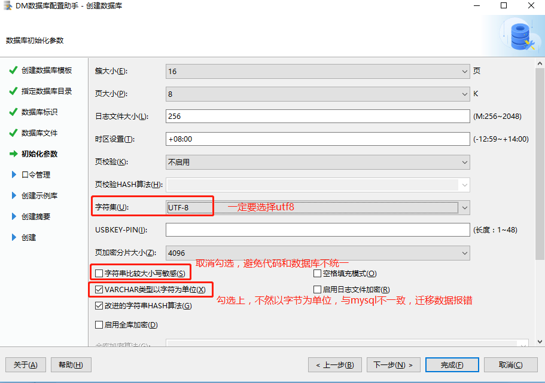
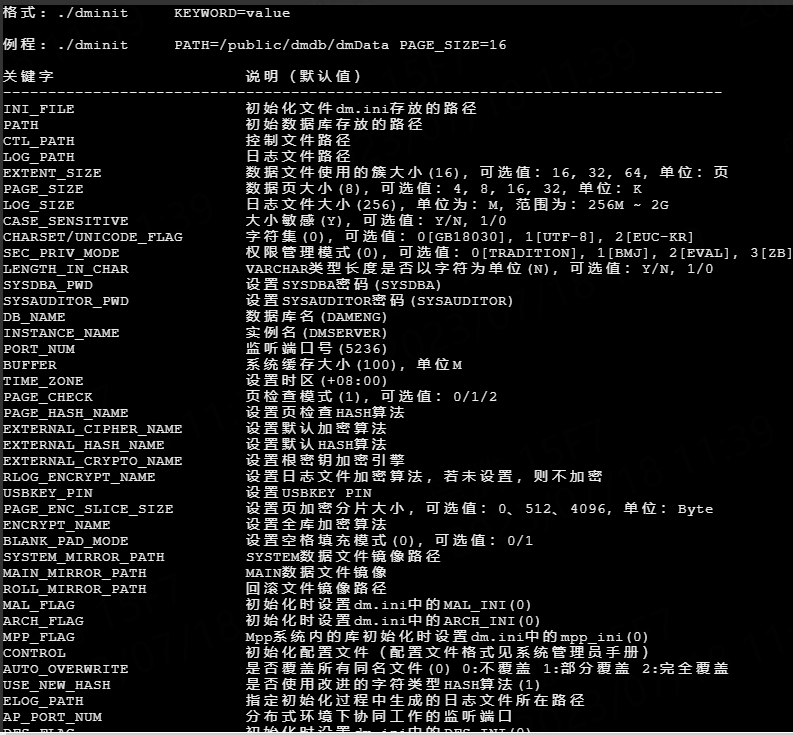
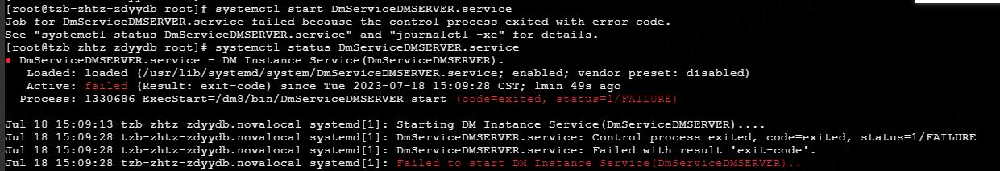

# 达梦数据库

## 图形化界面安装

### 下载

下载地址：`https://eco.dameng.com/download/`

选择符合操作系统版本下载


### 配置

官网地址：`https://eco.dameng.com/document/dm/zh-cn/start/dm-instance-windows.html`

**注意字符集选择`UTF-8`**，字符串大小写敏感，`varchar`字段存储单位等

进入到 `DM` 数据库安装目录下的 tool 目录中，使用 `./dbca.sh` 命令打开数据库配置助手进行图形化安装



配置数据库访问用户名和密码，默认为`SYSDBA`


## 命令行安装

打开目录`$DM_HOME/bin/`，此目录下输入`./dminit help`，命令行安装帮助指令



```shell
# path数据库路径，设置大小写不敏感，以varchar以字符长度，字符集为utf-8，设置管理员密码(不能有&)，数据库端口号5236
./dminit path=/dm8/data PAGE_SIZE=16 EXTENT_SIZE=16 CASE_SENSITIVE=n LENGTH_IN_CHAR=Y CHARSET=1 SYSDBA_PWD=SYSDBA PORT_NUM=5236
```

## 注册服务

命令行安装完成后必须注册数据库实例，才能启动

```shell
# 在$DM_HOME/script/root目录下
./dm_service_installer.sh -t dmserver -dm_ini /dm8/data/DAMENG/dm.ini -p DMSERVER
```

## 启动数据库实例

使用命令启动：`systemctl start DmServiceDMSERVER.service`

启动失败：



解决办法：

重新设定目录权限

```shell
# 格式 chown -R dmdba:dinstall + 数据库安装路径，下面示例：
chown -R dmdba:dinstall /dm8/data
```

## 命令行卸载数据库实例

```shell
# 首先找到数据库安装根目录 $DM_HOME
# 在目录$DM_HOME/script/root/ 下，执行脚本dm_service_uninstaller.sh
# 脚本模板 sh dm_service_uninstaller.sh -n + 服务名
# 服务名 = DmService + 数据库实例名（默认DMSERVER）
# 命令如下，执行卸载示例
sh dm_service_uninstaller.sh -n DmServiceDMSERVER
```

## 命令行进入数据库管理

```shell
# 特殊字符处理
./disql SYSDBA/'"test@202307"'@127.0.0.1:5236
# 默认
./disql SYSDBA/SYSDBA@127.0.0.1:5236
```

## 查询数据库配置

```sql
# 查询大小写敏感，0不敏感，1敏感
SELECT CASE_SENSITIVE();
# 查询字符集
SELECT (CASE SF_GET_UNICODE_FLAG() WHEN '0' THEN 'GBK18030' WHEN '1' THEN 'UTF-8' WHEN '2' THEN 'EUC-KR' END);
# TODO 查询VARCHAR类型对象的长度是否以字符为单位
SELECT LENGTH_IN_CHAR();
```

## 用户创建和授权

创建一个`TEST01`用户，授权`RESOURCE`权限

```shell
CREATE USER TEST01 IDENTIFIED BY "123456789";
GRANT RESOURCE TO TEST01;
# 给 DM 用户授予 dmhr 用户下 employee 表的 select 权限
GRANT SELECT ON dmhr.employee TO DM;
```

## 库表操作

### 创建表

操作当前**用户模式**（schema）下的表，无需加上模式名称，操作其他的需要加上schema前缀

如`SYSDBA`用户创建TEST模式下的表

```sql
# cluster primary key 表示聚族主键
# IDENTITY(1, 1) 表示自增，初始值1，增量步长1
# user是数据库关建字，最好不要使用
CREATE TABLE "TEST01"."sys_user"(
	id BIGINT IDENTITY(1, 1) cluster primary key COMMENT '主键',
	name VARCHAR(150) NOT NULL COMMENT '姓名',
	age int NOT NULL DEFAULT '0' COMMENT '年龄'
);
# 表注释
COMMENT ON TABLE "TEST01"."sys_user" IS '测试表';

# 查询表的自增id情况
SELECT ident_current('TEST01.sys_user');
SELECT ident_seed('TEST01.sys_user');
SELECT ident_incr('TEST01.sys_user');

# 创建非自增主键表
CREATE TABLE "TEST01"."sys_user"(
	id BIGINT COMMENT '主键',
	name VARCHAR(150) NOT NULL COMMENT '姓名',
	age int NOT NULL DEFAULT '0' COMMENT '年龄',
    NOT CLUSTER PRIMARY KEY("ID")
) STORAGE(ON "MAIN", CLUSTERBTR) ;

```

### 改表字段

改表字段语法与其他数据库不同

```sql
# 只改字段标识名称
ALTER TABLE "TEST01"."user" RENAME COLUMN "name" TO u;

# TODO
ALTER TABLE TEST01.test_user
MODIFY COLUMN name BIGINT NOT NULL DEFAULT '',
CHANGE COLUMN name username VARCHAR(150) NOT NULL COMMENT '用户姓名';
```


## maven依赖

将驱动包保存到本地maven仓库：在jar包目录下执行`cmd`命令

```shell
mvn install:install-file -Dfile=./DmJdbcDriver18.jar -DgroupId=com.dameng -DartifactId=DmJdbcDriver18 -Dversion=1.0 -Dpackaging=jar
```

maven依赖：

```xml
<dependency>
    <groupId>com.dameng</groupId>
    <artifactId>DmJdbcDriver18</artifactId>
    <version>1.0</version>
</dependency>
```

## 迁移问题

### 使用命令行导入

- DM数据库以模式区分，首先在bin目录下，使用`./disql 用户名/密码@127.0.0.1:5236`要进入到指定的模式下

- 使用命令`start sql文件绝对路径`，执行sql文件

### mysql迁移到DM

目前迁移工具版本`DM-V8-2023.04.17`，`mysql5.7`的迁移需要自己指定驱动，不然会报错，`mysql8.0`则可以使用默认驱动

`mysql5.7`迁移可以指定maven仓库的驱动包，路径为`mysql`

## 兼容问题

### 函数

**DATE_ADD**

```sql
# mysql 时间函数语法 DATE_ADD(#{nowTime},INTERVAL -#{timeout} SECOND)
select DATE_ADD('2020-01-01 10:22:33',INTERVAL - 10 SECOND)  # 2020-01-01 10:22:23
# DM 时间函数语法 DATE_ADD(SECOND, {timeout}, {nowTime})
SELECT DATEADD(SECOND, -10, '2022-09-19 16:09:35');  # 2022-09-19 16:09:25
```

**FIND_IN_SET**

```sql
# mysql FIND_IN_SET(value, string_list) 返回value在string_list中的位置
SELECT FIND_IN_SET('100', '0,100,1000') <> 0;  # 1(True)
SELECT FIND_IN_SET('10', '0,100,1000') <> 0;  # 0(False)
# DM SELECT LOCATE(value, string_list); 返回value在string_list中的位置
SELECT LOCATE(',100,', CONCAT(',', '0,100,1000', ','))  # 3(True)
SELECT LOCATE(',10,', CONCAT(',', '0,100,1000', ','))  # 0(False)
SELECT CASE WHEN LOCATE(',100,', CONCAT(',', '0,100,1000', ',')) <> 0 THEN '1' ELSE '0' END;  # 1(True)
# 下面sql会有语法错误，我不能理解
SELECT LOCATE(',10,', CONCAT(',', '0,100,1000', ',')) <> 0
```


